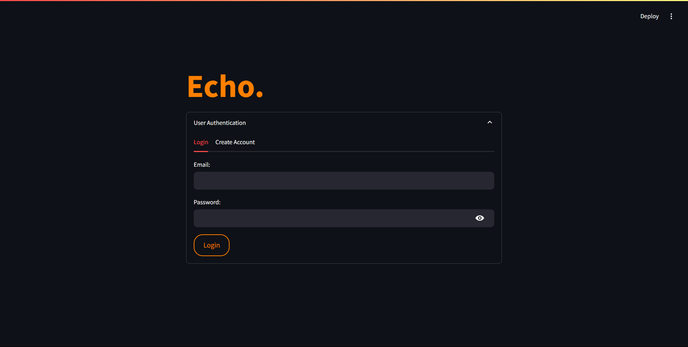
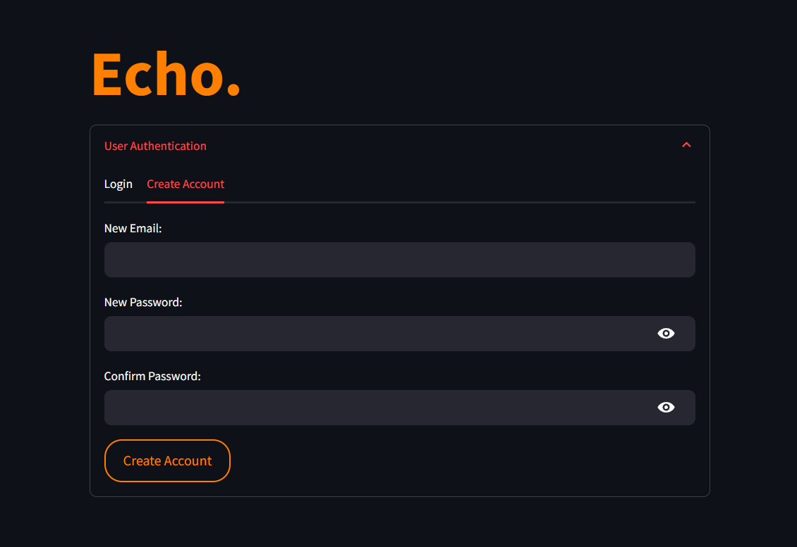
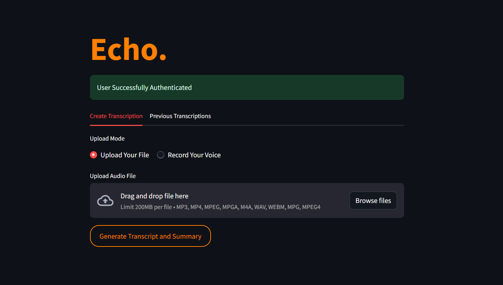
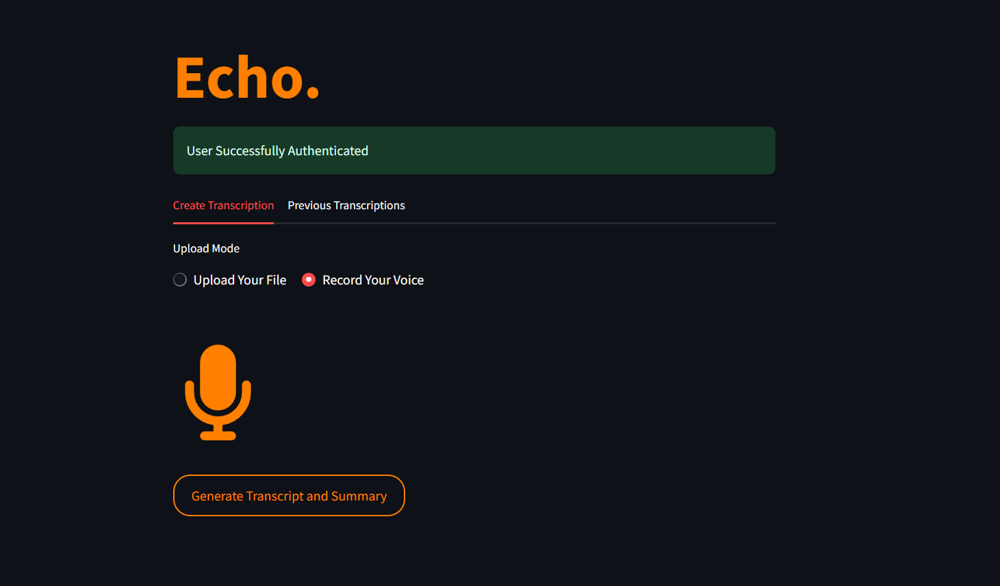
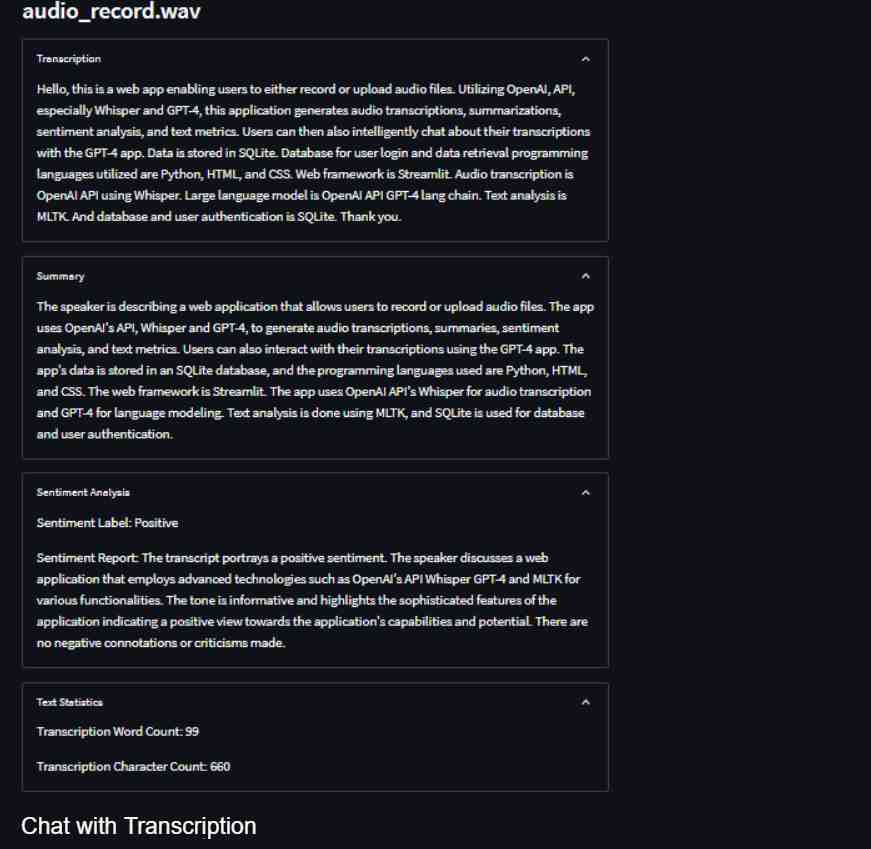
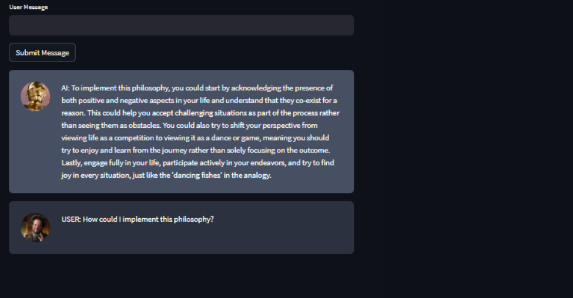

# Echo.

Echo. is an advanced audio transcription and analysis platform that leverages OpenAI's powerful APIs to provide intelligent insights from audio content. The application offers a seamless interface for uploading or recording audio, generating transcriptions, and analyzing the content through various AI-powered features.



## Features

### Authentication
- Secure user registration and login system
- Password validation with requirements for length and special characters
- Email format validation
- Session management for authenticated users

### Audio Input
- Support for multiple audio file formats (MP3, MP4, MPEG, MPGA, M4A, WAV, WEBM)
- Direct file upload with drag-and-drop functionality
- Real-time voice recording capability
- File size limit of 200MB

### AI-Powered Analysis
- High-accuracy audio transcription using OpenAI Whisper
- Automatic summary generation
- Sentiment analysis with detailed reports
- Fact-checking of transcribed content
- Text statistics including word frequency analysis

### Interactive Features
- Chat interface for discussing transcriptions
- Previous transcription access and management
- Real-time processing status indicators
- Expandable sections for different types of analysis

## Technology Stack

- **Frontend**: Streamlit
- **Backend**: Python
- **Database**: PostgreSQL
- **AI Services**: OpenAI (GPT-4, Whisper)
- **Authentication**: Custom implementation with password hashing
- **File Storage**: Local storage with binary data in PostgreSQL

## Installation

1. Clone the repository:
```bash
git clone <repository-url>
cd echo
```

2. Install required packages:
```bash
pip install -r requirements.txt
```

3. Set up your environment variables:
Create a .env file in the root directory with:
```
OPENAI_API_KEY=your_openai_api_key
```

4. Set up PostgreSQL database:
- Create a database named 'echo_db'
- Update DB_CONFIG in db_functions.py with your database credentials

5. Run the application:
```bash
streamlit run main.py
```

## Usage

1. **Authentication**
   - Create an account or login with existing credentials
   - Passwords must contain at least 8 characters, including uppercase, lowercase, numbers, and special characters

2. **Creating Transcriptions**
   - Choose between uploading an audio file or recording your voice
   - Click "Generate Transcript and Summary" to process the audio
   - View the generated transcription, summary, and analysis in the expandable sections

3. **Analyzing Results**
   - Review the transcription accuracy
   - Read the AI-generated summary
   - Check the sentiment analysis and fact-checking results
   - Explore text statistics and word frequency data

4. **Interacting with Transcriptions**
   - Use the chat interface to discuss specific parts of the transcription
   - Access previous transcriptions through the "Previous Transcriptions" tab
   - Compare and analyze multiple transcriptions

## Database Schema

The application uses the following PostgreSQL tables:
- Users (user_id, email, password)
- Transcripts (transcript_id, file_name, transcription, transcription_summary, sentiment_label, sentiment_report, prev_ai_research, fact_check, user_id)
- AudioFiles (audio_id, file_name, audio_data, transcript_id)
- Messages (message_id, role, message, transcript_id, user_id)

## Screenshots#







## Contributing

Contributions are welcome! Please feel free to submit a Pull Request.

## License

This project is licensed under the MIT License - see the LICENSE file for details.

Made with ❤️ by Saumya Subham Mishra